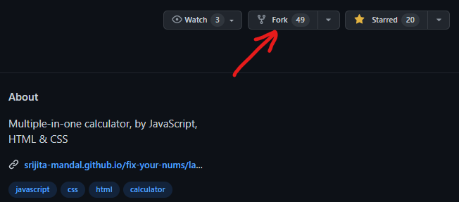
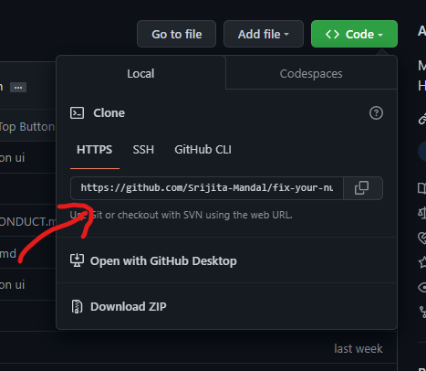

# Contributing Guideline

First of all thanks for your time to contribute :smiley: :partying_face:

This documentation contains a set of guidelines to help you during the contribution process.

<br>

# ▶️ Steps for contributing :
## Fork this repository

<br>
Fork this repository by clicking on the fork button on the top of this page.
This will create a copy of this repository in your account.
<br><br><br>

## Clone This Repository


Now clone the forked repository to your machine. 
Go to your GitHub account, open the forked repository, click on the code button and then click the copy to clipboard icon.
<br>

Open a terminal and run the following git command:
```
git clone https://github.com/<Your-Github-username>/fix-your-nums.git
```
<br>

## Create a branch

Change to the repository directory on your computer (if you are not already there):

```
cd fix-your-nums
```

Now create a branch using the `git checkout` command:

```
git checkout -b <branch-name>
```

For example:

```
git checkout -b add-new-calc
```

## Make necessary changes and commit those changes
If you go to the project directory and execute the command `git status`, you'll see there are changes.

Add those changes to the branch you just created using the git add command:

```
git add .
```
Now commit those changes using the git commit command:

```
git commit -m "Your commit message"
```
## Push changes to GitHub
Push the changes to the forked repository using:
```
git push origin <Your-branch-name>
```
Navigate to the original repository and make a pull request.

#### In case of merge conflict fetch and merge from the remote repository .

<br><br>
### 🔑Guidelines

Here are some set of guidelines to follow while contributing to `fix-your-nums` :

1. Welcome to this repository, if you are here as an open-source program participant/contributor.
2. Participants/contributors have to **comment** on issues they would like to work on, and mentors or the PA will assign you.
3. Issues will be assigned on a **first-come, first-serve basis.**
4. Participants/contributors can also **open their issues**, but it needs to be verified and labelled by a mentor. We respect all your contributions, whether 
it is an Issue or a Pull Request.
5. When you raise an issue, make sure you get it assigned to you before you start working on that project.
6. Each participant/contributor will be **assigned 1 issue (max)** at a time to work.
7. Don't create issues that are **already listed**.
8. Please don't pick up an issue already assigned to someone else. Work on the issues after it gets **assigned to you**.
9. Create your file in an appropriate folder with appropriate name and extension.
10. Pull requests will be merged after being **reviewed** by  mentor .
11. We all are here to learn. You are allowed to make mistakes. That's how you learn, right!.


## Are you a beginner in using Github?

You can refer to the following articles on the basics of Git and Github and also contact me, in case you are stuck:
- [Forking a Repo](https://help.github.com/en/github/getting-started-with-github/fork-a-repo)
- [Cloning a Repo](https://help.github.com/en/desktop/contributing-to-projects/creating-an-issue-or-pull-request)
- [How to create a Pull Request](https://opensource.com/article/19/7/create-pull-request-github)
- [Getting started with Git and GitHub](https://towardsdatascience.com/getting-started-with-git-and-github-6fcd0f2d4ac6)
- [Learn GitHub from Scratch](https://lab.github.com/githubtraining/introduction-to-github)
